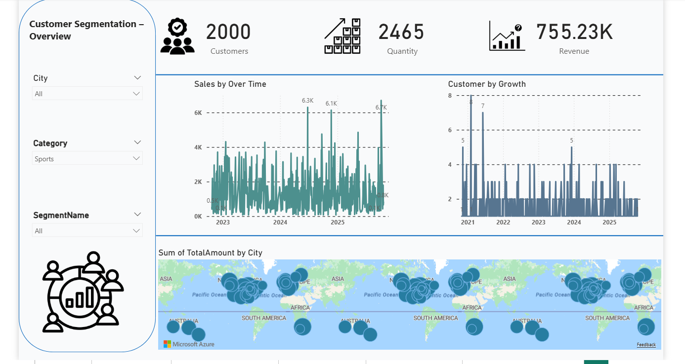

# 📊 Customer Segmentation Dashboard – Power BI

## 📌 Overview
This Power BI dashboard provides a comprehensive view of customer segmentation across multiple regions worldwide.  
It helps businesses understand customer behavior, category insights, revenue distribution, and growth trends to support data-driven marketing and sales decisions.

## 🎯 Objectives
- Segment customers by city, category, and segment type.
- Analyze sales, quantity, and revenue trends over time.
- Identify high-growth regions and categories.
- Visualize geographic distribution of revenue.
- Provide interactive filters for detailed drill-down analysis.

## 🛠 Tools & Skills Used
- Power BI
- DAX Measures
- Power Query (Data Cleaning & Transformation)
- Data Modeling (Star Schema)
- Map Visualizations
- Time Series Analysis

## 📁 Dataset
- **Customers**: 2000  
- **Transactions (Quantity)**: 2,465  
- **Total Revenue**: 755.23K  
- **Time Period**: 2021 – 2025  
- **Geographic Coverage**: Global (Americas, Europe, Asia, Africa, Australia)

## 📷 Dashboard Preview

## 🔍 Key Insights
- Revenue exceeded **755K**, with consistent sales growth over the years.
- Multiple cities worldwide show strong purchase activity, especially in North America and Europe.
- Customer growth peaked significantly in 2021 and 2022.
- Category filter reveals strong performance for the **Sports** segment.
- The map visualization highlights major geographic revenue hubs.

## 🚀 Features
- Fully interactive slicers (City, Category, Segment).
- KPI cards for customers, quantity, and revenue.
- Time-series charts showing growth and sales trends.
- Global map representation of total amount by city.
- Clean, modern UI optimized for stakeholders.

## 📦 Files Included
- `Customer_Segmentation.pbix`
- `Customer_Segmentation.png`
- `README.md`

